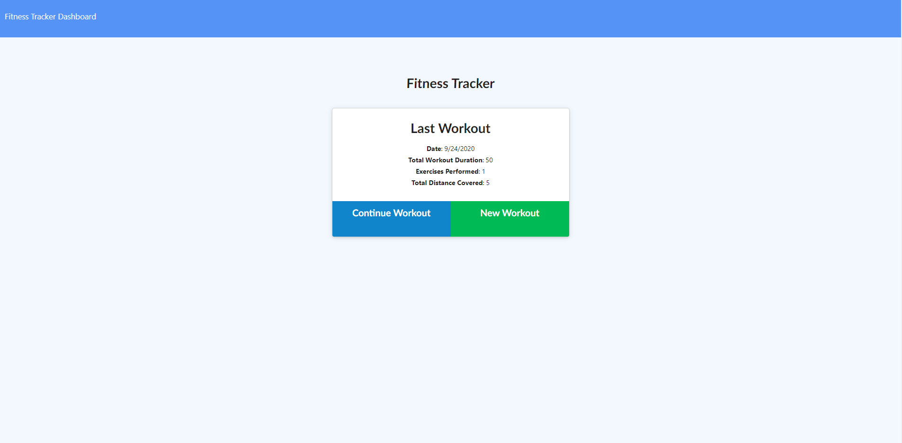
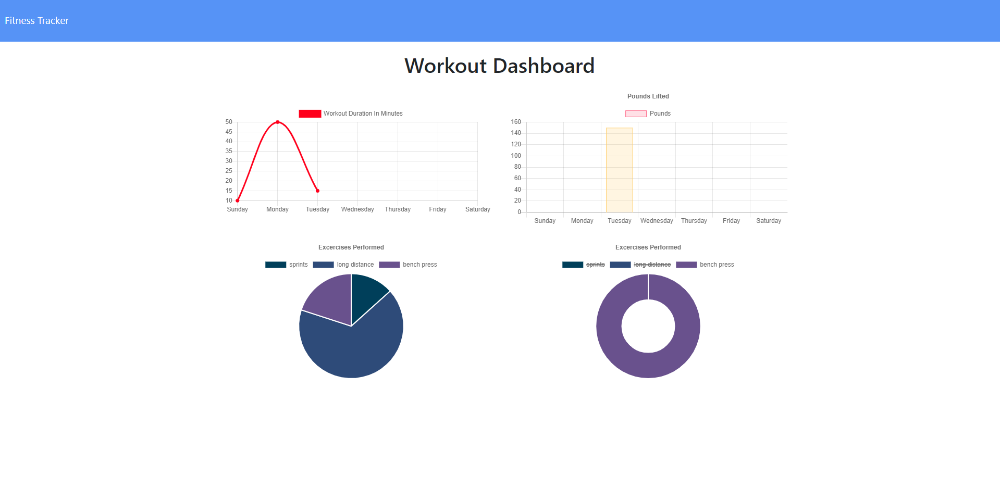
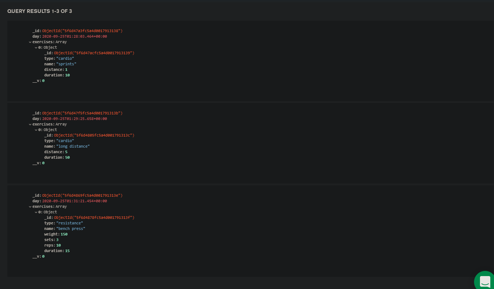

# workout_tracker

# Table of Contents

* [Process](#Process)
* [Issues](#Issues)
* [Video](#Video)
* [Link](#Link)
* [Screenshot](#Screenshot)

# Process

First click new workout button.

Next either choose resistance or cardio workout in the dropdown bar.

Next after choosing eith fill out the workout information and click add exercise.

Next click the complete button and click fitness tracker dashboard.

You will see the dashboard of all workouts added toegther on multiple charts.

Next click fitness tracker in the top left and start all over again.

# Issues

Biggest issue was remembering how to connect to mongoDb Atlas again and 

putting in the correct password and dbname to be able to connect proeprly.

Coding wise had an issue adding all the workouts done together but thanks to 

my instructor he showed a way using virtuals which made everything easier.

Next forgot code to show information in the dashboard I started coding

but forgot to finish the function so it cause a blank page.

# Link 

[Link to Heroku site](https://tracking-your-fitness.herokuapp.com/?id=5f6d4869fc5a4d001791313e)

# Screenshot

